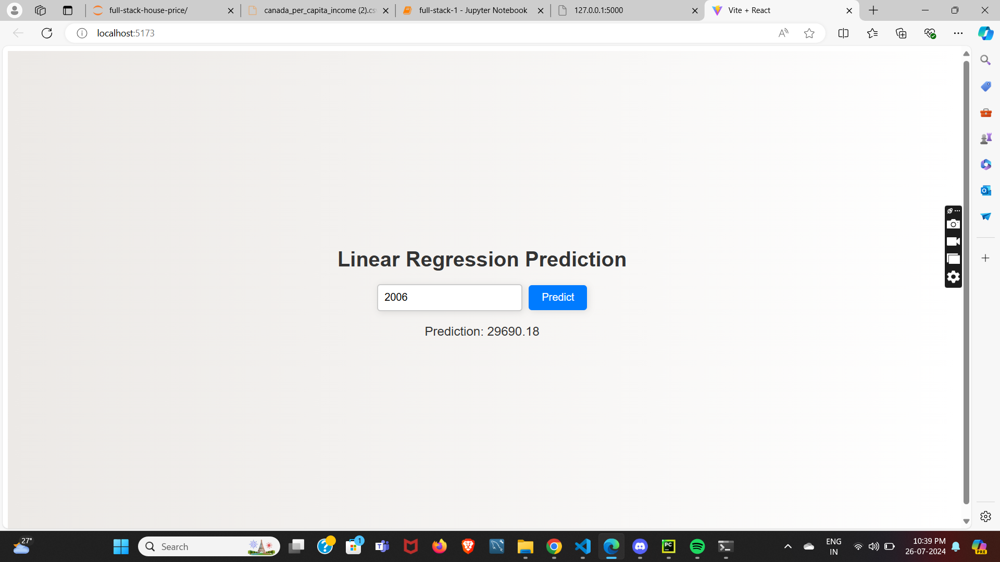

# House Price Prediction with Simple Linear Regression

This project demonstrates how to predict house prices using simple linear regression with Python.

## Steps

1. Load the dataset.
2. Preprocess the data.
3. Train a simple linear regression model.
4. Make predictions and evaluate the model.

## Screenshot

Here is a screenshot of the model's predictions:

## Requirements

- Python 3.x
- Pandas
- Scikit-learn

## Usage

1. Clone the repository.
2. Install the required packages.
3. Run the `house_price_prediction.py` script.
